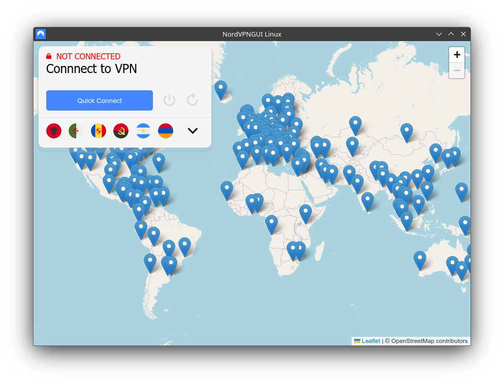

# NordVPNGUI-Linux

NordVPN GUI for Linux

### Because of a not yet existent versioning system and wayland issues. You have to build the project yourself

## Screenshot

## Features

- Control vpn connection
- Map
- Server list
- P2P, Double VPN, Onion
- ~~Login~~ Not available yet due to wayland bug. See [#59](https://github.com/energye/energy/issues/59)
## ToDo

- Settings
- Meshnet
- File sharing via Meshnet
- i18n support
- Obfuscated connection
- Fix layout bugs
## Images used

- NordVPN logo. Taken from [NordVpnLinuxGUI](https://github.com/GoBig87/NordVpnLinuxGUI/blob/main/icon.jpg)
- Product logo (Login) [Press Area](https://nordvpn.com/de/press-area/)
- Round flags [circle-flags](https://github.com/HatScripts/circle-flags)
- Specialty servers (Extracted from NordVPN windows)
## Built with

- [Energy](https://github.com/energye/energy)
- Go
- OpenStreetMap [Leaflet](https://leafletjs.com/)

## Building

1. Clone repository with --recursive
2. ./install-requirements.sh
3. ./install-devtools.sh
4. For debug ./build-debug.sh and for release ./build-release.sh